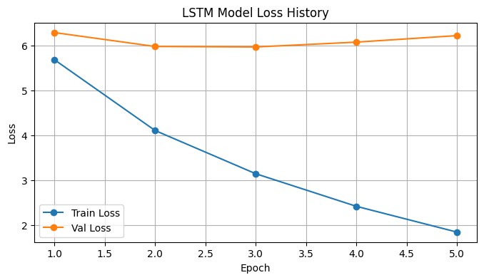
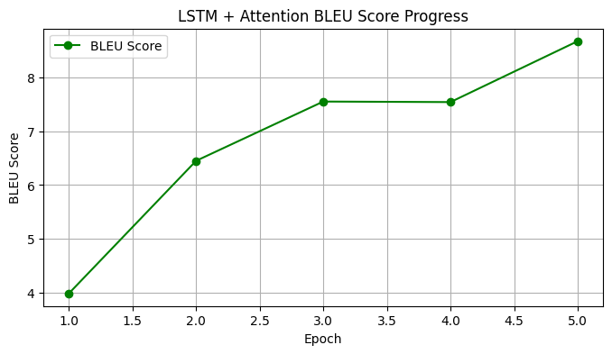
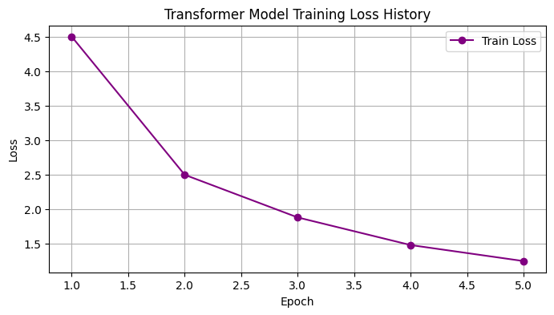

# Neural Machine Translation: LSTM, Luong Attention and Transformer

## Overview

This project presents a comparative study of three neural machine translation (NMT) architectures for **English-to-Russian translation**:

- LSTM Encoder–Decoder
- LSTM Seq2Seq with Luong Attention
- Transformer

All models were implemented in **PyTorch** and evaluated on the same parallel corpus. The main objective is to compare their training behavior and translation quality using validation loss and corpus-level BLEU score.

## Dataset

The project uses the English–Russian portion of the **Tatoeba** parallel corpus:

`sentence-transformers/parallel-sentences-tatoeba`

The data pipeline:

1. downloads and caches the dataset;
2. creates a 5% held-out test split;
3. uses 300,000 sentence pairs for training;
4. uses the following 2,000 sentence pairs for validation;
5. builds separate English and Russian vocabularies from the training data.

Processed data and vocabulary artifacts are stored in `data/processed/`.

## Models

### 1. LSTM Encoder–Decoder

A standard recurrent Seq2Seq architecture with separate LSTM encoder and decoder.

| Parameter | Value |
|---|---:|
| Embedding dimension | 256 |
| Hidden dimension | 512 |
| LSTM layers | 1 |
| Optimizer | Adam |
| Learning rate | `1e-3` |
| Teacher forcing | Used |

### 2. LSTM + Luong Attention

An LSTM-based Seq2Seq model extended with **multiplicative Luong Attention**. The decoder attends to the sequence of encoder hidden states at each decoding step rather than relying only on the final encoder state.

| Parameter | Value |
|---|---:|
| Embedding dimension | 256 |
| Hidden dimension | 512 |
| LSTM layers | 1 |
| Attention | Luong (multiplicative) |
| Optimizer | Adam |
| Learning rate | `1e-3` |

### 3. Transformer

An encoder–decoder Transformer implemented in PyTorch.

| Parameter | Value |
|---|---:|
| Model dimension | 512 |
| Layers | 6 |
| Attention heads | 8 |
| Feed-forward dimension | 2048 |
| Dropout | 0.2 |
| Optimizer | AdamW |
| Learning rate | `2e-4` |
| Weight decay | `0.01` |
| LR schedule | OneCycle |

## Evaluation

Translation quality is evaluated using **corpus-level BLEU** from NLTK. Before scoring, reference and hypothesis sentences are converted to lowercase and tokenized using whitespace splitting.

BLEU is used as the main metric for this study. It provides a simple and reproducible basis for comparing the three models, but it does not provide a comprehensive evaluation of machine translation quality.

## Results

All models were trained for **5 epochs**.

| Model | Final Validation BLEU |
|---|---:|
| LSTM Encoder–Decoder | 7.97 |
| LSTM + Luong Attention | **8.67** |
| Transformer | **16.18** |

Under the selected experimental configurations, the Transformer achieved the highest validation BLEU. Luong Attention provided a smaller but measurable improvement over the basic LSTM model.

The models were not explicitly matched by parameter count or computational complexity. Therefore, these results should be interpreted as a comparison of the selected implementations and configurations rather than a controlled comparison of architectures at equal model capacity.

### Training Curves

#### LSTM Encoder–Decoder



Final BLEU: **7.97**

#### LSTM + Luong Attention



Final BLEU: **8.67**

#### Transformer



Final BLEU: **16.18**

The recurrent experiments include both loss and BLEU progression. For the Transformer, the repository currently contains the training-loss history and the final validation BLEU score.

## Project Structure

```text
NMT-models-comparison/
│
├── src/
│   ├── models/
│   │   ├── lstm_seq2seq.py
│   │   ├── lstm_with_luong_attention.py
│   │   └── transformer.py
│   │
│   ├── pipelines/
│   │   ├── train_lstm.py
│   │   ├── train_lstm_attention.py
│   │   └── train_transformer.py
│   │
│   └── dataset.py
│
├── data/
│   ├── raw/
│   └── processed/
│
├── results/
│   ├── lstm_graphics.png
│   ├── luong_graphics.png
│   └── transformer_graphics.png
│
├── prepare_data.py
├── train.py
├── evaluate.py
├── infer.py
├── requirements.txt
└── README.md
```

## Installation

Create a Python environment and install the required dependencies:

```bash
pip install -r requirements.txt
```

Main dependencies include:

- PyTorch
- pandas
- Hugging Face Datasets
- scikit-learn
- tqdm
- NLTK

## Training

The main entry point is `train.py`.

```bash
python train.py --model lstm
```

Available models:

```text
lstm
lstm_attention
transformer
```

Training parameters such as the number of epochs and batch size can be specified from the command line:

```bash
python train.py --model transformer --epochs 5 --batch_size 64
```

## Evaluation and Inference

Evaluation and inference are provided as separate scripts:

```bash
python evaluate.py
python infer.py
```

## Conclusion

Under the selected experimental configurations, the results show a clear difference in validation BLEU:

**LSTM → LSTM + Luong Attention → Transformer**

**7.97 → 8.67 → 16.18**

The Transformer achieved the highest score, while Luong Attention improved the recurrent baseline. Since the models were not controlled for equal parameter count or computational complexity, the results demonstrate the performance of these particular implementations rather than proving that one architecture is universally superior.
